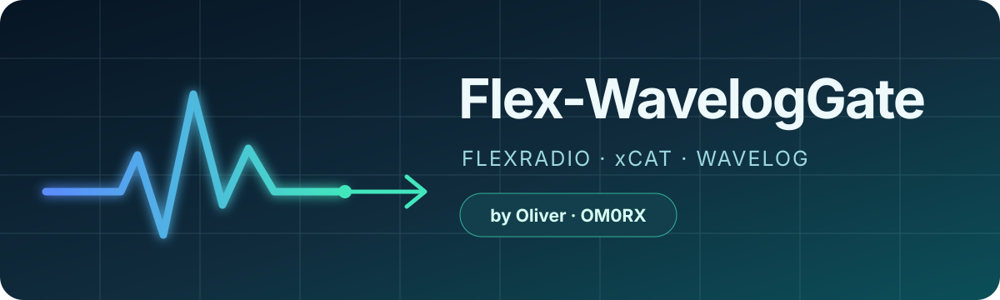

<p align="center">
  
</p>

<p align="center">
  <a href="https://github.com/oliverbross/Flex-WavelogGate/releases/latest"></a>
  <a href="https://github.com/oliverbross/Flex-WavelogGate/actions/workflows/ci.yml"></a>
  <a href="LICENSE"></a>
  
</p>

<p align="center">
  A focused desktop bridge that reads a FlexRadio through <strong>xCAT</strong>
  and keeps <strong>Wavelog</strong> in sync with the live frequency and mode.
</p>

<p align="center">
  Created and maintained by <strong>Oliver · OM0RX</strong>
</p>

---

## Why this exists

WaveLogGate already provides excellent pairing, QSO forwarding and browser
integration for Wavelog. Flex-WavelogGate is a purpose-built variant for stations
where a FlexRadio slice is exposed by **DL3LSM xCAT**.

The upstream generic Hamlib client probes features that xCAT 2.0 does not expose.
This edition uses the small RigCtlD subset xCAT supports, avoids unsupported
queries, and gives the station one predictable radio path.

```text
FlexRadio / Maestro
        │
        ▼
      xCAT
  CAT + RigCtlD
        │  TCP 4532
        ▼
Flex-WavelogGate
        │  Wavelog radio API
        ▼
     Wavelog
 Hardware Interfaces → Add QSO
```

## What it does

- Reads the active xCAT slice frequency and mode every second.
- Posts changes to Wavelog immediately and refreshes stable state periodically.
- Preserves Wavelog pairing, station profiles, QSO forwarding, local QSY and
  WebSocket services from WaveLogGate.
- Normalizes USB, LSB, CW, RTTY, AM and FM into modes Wavelog can select.
- Recognizes FT8 and FT4 when xCAT reports a generic data mode on their
  conventional dial frequencies.
- Accepts Wavelog QSY requests through xCAT's supported frequency/mode commands.
- Never asserts PTT.
- Leaves rotor control separate and unchanged.

## Download

Get the current binaries from
[GitHub Releases](https://github.com/oliverbross/Flex-WavelogGate/releases/latest).

| Platform | Release artifact |
|---|---|
| macOS Apple Silicon | `Flex-WavelogGate-darwin-arm64.dmg` |
| macOS Intel | `Flex-WavelogGate-darwin-amd64.dmg` |
| Windows x64 | `Flex-WavelogGate-windows-amd64-x64.exe` |
| Windows ARM64 | `Flex-WavelogGate-windows-arm64.exe` |
| Windows 32-bit | `Flex-WavelogGate-windows-i386-x86.exe` |
| Debian/Ubuntu | architecture and WebKit-matched `.deb` |
| Fedora/RHEL | architecture and WebKit-matched `.rpm` |

Every release includes `SHA256SUMS.txt`.

### Platform notes

- **macOS:** open the DMG, drag the app to Applications, then Control-click the
  app and choose **Open** if Gatekeeper identifies it as a community build.
- **Windows:** download the matching executable. Review the publisher details if
  SmartScreen appears.
- **Linux:** choose WebKit 4.0 for older distributions such as Ubuntu 22.04 and
  WebKit 4.1 for newer distributions such as Ubuntu 24.04. GTK 3 and the
  matching WebKit2GTK runtime must be installed.

## Quick start

1. Download xCAT from the
   [official DL3LSM downloads page](https://dl3lsm.blogspot.com/p/downloads.html).
2. In xCAT, connect the intended station/slice and select **CAT and RigCtlD**.
3. Confirm xCAT reports **Slice present**.
4. Note the **RigCtlD Port**, normally `4532`.
5. Start Flex-WavelogGate.
6. Configure the Wavelog URL, API key, station and radio name.
7. Enable **xCAT Radio Control** using `127.0.0.1:4532`.
8. In Wavelog → **Hardware Interfaces**, set the new radio as default.
9. Open **Add QSO** and allow one polling interval for the live values to appear.

> Use xCAT's **RigCtlD Port 4532**. Do not point Flex-WavelogGate at the
> radio-specific **CAT Port 5002**.

The complete walkthrough, networking advice, read-only test command and
troubleshooting table are in [docs/XCAT_SETUP.md](docs/XCAT_SETUP.md).

## xCAT compatibility

The tested integration is **DL3LSM xCAT 2.0 on macOS**. DL3LSM documents xCAT
2.0 for SmartSDR 2.5.1 and newer; the author's download page retains xCAT 1.0
for SmartSDR 2.4.9 and older.

Flex-WavelogGate binaries are built for macOS, Windows and Linux. When
Flex-WavelogGate runs on a different computer, its xCAT host can be a LAN
address, provided the RigCtlD endpoint is reachable. Keeping xCAT and
Flex-WavelogGate together on the Mac at `127.0.0.1` is the recommended setup.

## Mode handling

| xCAT state | Wavelog mode |
|---|---|
| `USB`, `LSB` | `USB`, `LSB` |
| `CW`, `CWR` | `CW` |
| `RTTY`, `RTTYR` | `RTTY` |
| `AM`, `FM`, `PKTFM` | `AM`, `FM` |
| data mode on a recognized FT8 frequency | `FT8` |
| data mode on a recognized FT4 frequency | `FT4` |
| data mode elsewhere | underlying `USB` or `LSB` |

A CAT interface knows the radio's demodulation mode, not which digital program
is generating audio. Outside recognized FT8/FT4 dial frequencies the safe,
truthful result is therefore the underlying sideband. Logged QSO/ADIF messages
from digital applications still carry their exact operating mode.

## Wavelog pairing and migration

On first launch, when no Flex-WavelogGate configuration exists, the application
copies an existing WaveLogGate configuration into its own location:

```text
~/Library/Application Support/WavelogGate/config.json
  → ~/Library/Application Support/Flex-WavelogGate/config.json
```

The original file is never edited or removed. Wavelog URL, API key, station ID,
radio name and other profiles are preserved; legacy FLRig/Hamlib radio choices
are disabled and xCAT defaults to `127.0.0.1:4532`.

API keys stay in the per-user configuration. They are not compiled into the app
or committed to this repository.

## Services retained from WaveLogGate

| Port | Protocol | Purpose |
|---:|---|---|
| `2333` | UDP inbound | QSO packets from WSJT-X/FLDigi |
| `54321` | HTTP/HTTPS inbound | QSY requests from Wavelog |
| `54322` | WebSocket | local radio status and Wavelog events |
| `54323` | secure WebSocket | TLS WebSocket endpoint |

For WSJT-X, configure the **Secondary UDP Server** as `localhost:2333`.

## Safety boundaries

- Radio polling uses only xCAT's `f` and `m` requests.
- QSY uses the supported `F` and optional `M` setters.
- PTT is never asserted.
- Split-VFO and RF-power probes are not sent.
- Rotor commands are not routed through xCAT.
- Do not expose RigCtlD directly to the public internet; use a trusted LAN or
  private VPN.

## Build from source

Requirements:

- Go 1.25+
- Wails CLI 2.13.0
- Bun

```bash
go install github.com/wailsapp/wails/v2/cmd/wails@v2.13.0
wails build -clean
go test ./...
go vet ./...
```

`wails build` generates the bindings and runs the locked Bun install and frontend build configured in `wails.json`.

With a local xCAT endpoint, the optional integration test is read-only:

```bash
go test -tags integration -run TestLiveXCAT -v ./internal/radio
```

## Project history and credits

**Flex-WavelogGate was created by Oliver (OM0RX).**

It is based on
[WaveLogGate v2.1.1](https://github.com/wavelog/WaveLogGate/tree/v2.1.1) at
upstream commit `9344a4852ad461b60a50fbb384e2afdf17f6e414`. Credit and the original
MIT notice for WaveLogGate by Jörg Dorgeist (DJ7NT) are preserved in
[NOTICE](NOTICE).

Thanks to:

- [Wavelog](https://github.com/wavelog/wavelog) and the WaveLogGate contributors.
- Mario, DL3LSM, for xCAT and its FlexRadio integration.
- The Wails, Go and Svelte communities.

FlexRadio is a trademark of FlexRadio Systems. This community project is not
affiliated with or endorsed by FlexRadio Systems, Wavelog, or the xCAT author.

## License

Copyright © 2026 Oliver (OM0RX).

Flex-WavelogGate modifications are licensed under the
[GNU General Public License v3.0 or later](LICENSE). Upstream and bundled
third-party notices remain available in [NOTICE](NOTICE) and their respective
source directories.
